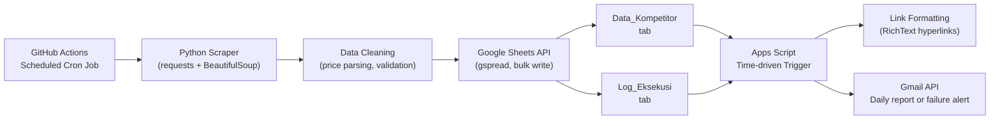
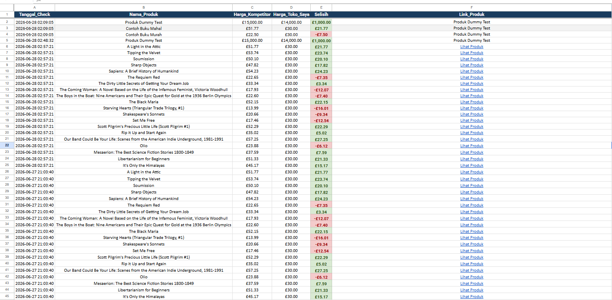

# 🛍️ UMKM Automated Growth Kit

> An end-to-end automated competitor price monitoring pipeline for small businesses (UMKM).
> Pipeline pemantauan harga kompetitor yang berjalan otomatis penuh untuk UMKM.


### 🌐 Quick Links
- 🇺🇸 [English Version](#english-version)
- 🇮🇩 [Versi Bahasa Indonesia](#versi-bahasa-indonesia)

---

## English Version

### 📌 Overview

Small business (UMKM) owners rarely have time to manually track competitor pricing across multiple online stores. **UMKM Automated Growth Kit** solves this by running a fully automated daily pipeline that:

1. Scrapes competitor product data from the web.
2. Compares it against the owner's own pricing.
3. Writes structured results into a shared Google Sheet.
4. Sends a daily email summary, or an automatic alert if the pipeline fails.

No manual intervention required after setup. The entire flow runs on a schedule, in the cloud, for free.

> **Note:** This implementation targets [books.toscrape.com](https://books.toscrape.com) as a safe, legal scraping sandbox to demonstrate the architecture. The pipeline is designed to be retargeted to any e-commerce catalog with minimal changes to the parsing logic.

### 🏗️ Architecture



**Why this split?** Python handles everything that benefits from a real programming language (HTTP requests, HTML parsing, error recovery). Google Apps Script handles everything that lives naturally inside the spreadsheet (cell formatting, Gmail integration); each tool is used where it's strongest, rather than forcing one language to do both jobs.

### ⚙️ Tech Stack

| Layer | Technology | Purpose |
|---|---|---|
| Scraping | Python, `requests`, `BeautifulSoup4` | Extract competitor product data |
| Data handling | Python, `pandas`-compatible dicts | Clean and structure scraped data |
| Storage | Google Sheets API (`gspread`) | Shared, human-readable data store |
| Scheduling | GitHub Actions (cron) | Free, serverless automation |
| Post-processing | Google Apps Script | In-sheet formatting, Gmail notifications |
| Notification | Gmail API (via Apps Script) | Daily summary / failure alerts |

### 🔐 Security & Credential Management

Credential safety was treated as a first-class requirement, not an afterthought:

- **`credentials.json` (Google Service Account key) never leaves the local machine or CI runner's ephemeral filesystem.** It is excluded via `.gitignore` and never committed to version control.
- **GitHub Actions authenticates using a repository secret** (`GOOGLE_CREDENTIALS_JSON`), injected as an environment variable at runtime and written to a temporary file that is deleted immediately after the pipeline finishes (`if: always()` cleanup step).
- **Principle of least privilege:** the Service Account only has `spreadsheets` scope (not full Drive access) since the pipeline accesses the sheet directly by ID rather than by searching Drive.
- The Service Account is shared with the target Sheet explicitly (Editor access only), rather than relying on broader account-level permissions.

```yaml
# Excerpt from .github/workflows/main.yml
- name: Write credentials.json from secret
  env:
    GOOGLE_CREDENTIALS_JSON: ${{ secrets.GOOGLE_CREDENTIALS_JSON }}
  run: printf '%s' "$GOOGLE_CREDENTIALS_JSON" > credentials.json

- name: Clean up credentials
  if: always()
  run: rm -f credentials.json
```

### 🧠 Engineering Decisions

A few design choices that came directly from problems discovered during development, included here because *why* a decision was made is usually more informative than *what* was built:

**1. Idempotent link processing (Apps Script)**
The Apps Script post-processor (`processNewData`) tracks the last row it has processed using `PropertiesService`, rather than re-scanning the entire sheet every run. This prevents wasted API calls and accidental reprocessing of rows that were already handled.

It also processes cells individually and **skips any cell that doesn't look like a valid URL**, rather than overwriting it with whatever value was read. An earlier version blindly rewrote every cell it touched, which caused a real data-loss bug when it read back a broken formula's error string and wrote that literal text over the original URL. The current version treats "not sure what this is" as a reason to leave it alone, not a reason to overwrite it.

**2. Empty-result detection, not just exception handling**
The scraper returns an empty list (`[]`) instead of raising an exception when scraping yields zero results (e.g., site down, HTML structure changed). The pipeline explicitly checks for this case (`if not data:`) and logs it as a `FAILED` run. Relying on `try/except` alone would have silently treated "0 products scraped, no errors thrown" as a successful run.

**3. Failure-aware daily reporting**
`sendDailyReport()` checks the latest entry in the execution log *before* sending anything. If the last successful run isn't from today, it sends a failure alert instead of a stale/misleading "everything is fine" report.

**4. Bulk writes over per-row API calls**
Data is written to Google Sheets using a single `append_rows()` batch call per pipeline run, instead of looping `append_row()` per product. This keeps the pipeline well within Google Sheets API rate limits even as the product catalog grows.

**5. Explicit timezone, not host system clock**
`datetime.now()` is naive: it returns whatever wall-clock time the host machine happens to have. Since this pipeline runs from two different environments (a local Windows machine in WIB, and a GitHub Actions runner in UTC), relying on it produced timestamps that were 7 hours apart depending on where the script executed. The fix uses Python's `zoneinfo` to explicitly convert to `Asia/Jakarta` regardless of host timezone. One platform-specific catch: Windows doesn't ship with the IANA timezone database that `zoneinfo` needs, so `tzdata` was added as an explicit dependency. Without it, the same code that worked fine on the Linux CI runner would raise `ZoneInfoNotFoundError` on a Windows machine.

### 📂 Project Structure

```
UMKM-Automation-Kit/
├── .github/
│   └── workflows/
│       └── main.yml              # Scheduled + manually-triggerable CI pipeline
├── .gitignore                     # Excludes credentials.json and local artifacts
├── requirements.txt
├── scrape_data.py                 # BeautifulSoup scraper module
├── sheets_client.py                # Google Sheets connection, write, and logging
├── main_pipeline.py                 # Orchestrator: connect -> scrape -> write -> log
├── test_sheets_connection.py        # Standalone connectivity diagnostic script
└── Code.gs                          # Apps Script: link formatting + Gmail reporting
```

### 🚀 Setup

**1. Clone and install dependencies**
```bash
git clone https://github.com/shaquilleajirurrahman-glitch/UMKM-Automation-Kit.git
cd UMKM-Automation-Kit
pip install -r requirements.txt
```

**2. Set up Google Cloud credentials**
1. Enable the **Google Sheets API** in [Google Cloud Console](https://console.cloud.google.com).
2. Create a **Service Account** and download its JSON key as `credentials.json`.
3. Share your target Google Sheet with the Service Account's email (`client_email` in the JSON) with **Editor** access.

**3. Configure the project**
```python
# in sheets_client.py
SPREADSHEET_ID = "1Al6QyTsCu-J76jNe2ju0PoGUBqDIxtc4FXHft_YR-is"
```

**4. Run locally**
```bash
python main_pipeline.py
```

**5. Automate via GitHub Actions**
Add the contents of `credentials.json` as a repository secret named `GOOGLE_CREDENTIALS_JSON`, then push. The workflow runs on schedule and can also be triggered manually from the **Actions** tab.

**6. Set up Apps Script reporting**
Paste `Code.gs` into Extensions → Apps Script (`RECIPIENT_EMAIL` is already set to `shaquille41838@gmail.com`), run both functions manually once to authorize, then add a time-driven trigger for `dailyAutomation`.

### 📈 Sample Output



Positive `Selisih` (green) means the user's store is more competitively priced; negative (red) flags a competitor undercutting the user's price.

### 🔭 Future Improvements

- Replace the hardcoded `Harga_Toko_Saya` placeholder with a real lookup against the user's actual product catalog.
- Support multiple competitor sources, not just a single catalog.
- Paginate scraping across multiple catalog pages for larger product sets.

### 📄 License

MIT. Feel free to fork and adapt for your own use case.

---

## Versi Bahasa Indonesia

### 📌 Ringkasan

Pemilik usaha kecil (UMKM) jarang punya waktu untuk memantau harga kompetitor secara manual di berbagai toko online. **UMKM Automated Growth Kit** menyelesaikan ini dengan menjalankan pipeline otomatis harian yang:

1. Mengambil data produk kompetitor dari web (scraping).
2. Membandingkannya dengan harga toko milik pengguna.
3. Menulis hasilnya secara terstruktur ke Google Sheet.
4. Mengirim ringkasan harian via email, atau alert otomatis kalau pipeline-nya gagal.

Tidak perlu intervensi manual setelah setup awal. Seluruh alur berjalan terjadwal, di cloud, tanpa biaya.

> **Catatan:** Implementasi ini menyasar [books.toscrape.com](https://books.toscrape.com) sebagai sandbox scraping yang aman dan legal untuk mendemonstrasikan arsitekturnya. Pipeline ini dirancang agar mudah diarahkan ulang ke katalog e-commerce apa pun dengan perubahan minimal pada logika parsing.

### 🏗️ Arsitektur

*(Lihat diagram Mermaid di bagian [English Version](#english-version) di atas. Diagram bersifat universal/tidak bergantung bahasa.)*

**Kenapa dipisah begini?** Python menangani semua hal yang lebih cocok ditangani bahasa pemrograman sungguhan (HTTP request, parsing HTML, penanganan error). Google Apps Script menangani semua hal yang secara alami hidup di dalam spreadsheet (formatting cell, integrasi Gmail); masing-masing tool dipakai di area yang paling kuat, bukan memaksa satu bahasa mengerjakan semuanya.

### ⚙️ Tech Stack

| Layer | Teknologi | Fungsi |
|---|---|---|
| Scraping | Python, `requests`, `BeautifulSoup4` | Mengambil data produk kompetitor |
| Pengolahan data | Python, dict kompatibel `pandas` | Membersihkan dan menstrukturkan data hasil scraping |
| Penyimpanan | Google Sheets API (`gspread`) | Penyimpanan data yang mudah dibaca dan dibagikan |
| Penjadwalan | GitHub Actions (cron) | Otomatisasi serverless, gratis |
| Post-processing | Google Apps Script | Formatting di dalam sheet, notifikasi Gmail |
| Notifikasi | Gmail API (via Apps Script) | Ringkasan harian / alert kegagalan |

### 🔐 Keamanan & Manajemen Kredensial

Keamanan kredensial diperlakukan sebagai kebutuhan utama, bukan tambahan belakangan:

- **`credentials.json` (kunci Service Account Google) tidak pernah keluar dari komputer lokal atau filesystem sementara CI runner.** File ini dikecualikan lewat `.gitignore` dan tidak pernah ter-commit ke version control.
- **GitHub Actions melakukan autentikasi memakai repository secret** (`GOOGLE_CREDENTIALS_JSON`), disuntikkan sebagai environment variable saat runtime dan ditulis ke file sementara yang langsung dihapus setelah pipeline selesai (`if: always()`).
- **Prinsip least privilege:** Service Account hanya punya scope `spreadsheets` (bukan akses Drive penuh) karena pipeline mengakses sheet langsung lewat ID, bukan dengan mencari di Drive.
- Service Account di-share secara eksplisit ke Sheet target (akses Editor saja), bukan mengandalkan permission level akun yang lebih luas.

```yaml
# Cuplikan dari .github/workflows/main.yml
- name: Write credentials.json from secret
  env:
    GOOGLE_CREDENTIALS_JSON: ${{ secrets.GOOGLE_CREDENTIALS_JSON }}
  run: printf '%s' "$GOOGLE_CREDENTIALS_JSON" > credentials.json

- name: Clean up credentials
  if: always()
  run: rm -f credentials.json
```

### 🧠 Keputusan Desain Teknis

Beberapa keputusan desain yang muncul langsung dari masalah nyata yang ditemukan selama pengembangan, dicantumkan di sini karena *kenapa* sebuah keputusan dibuat biasanya lebih informatif daripada *apa* yang dibangun:

**1. Pemrosesan link yang idempotent (Apps Script)**
Post-processor Apps Script (`processNewData`) melacak baris terakhir yang sudah diproses memakai `PropertiesService`, bukan memindai ulang seluruh sheet setiap kali jalan. Ini mencegah pemborosan API call dan pemrosesan ulang yang tidak sengaja pada baris yang sudah pernah ditangani.

Script ini juga memproses cell satu per satu dan **melewati (skip) total cell yang isinya bukan URL valid**, bukan menimpanya dengan apa pun yang terbaca. Versi sebelumnya menulis ulang setiap cell yang disentuh tanpa pandang bulu, ini menyebabkan bug data hilang nyata ketika script membaca balik teks error dari formula yang rusak, lalu menimpa URL asli dengan teks error itu sendiri. Versi saat ini memperlakukan "tidak yakin ini apa" sebagai alasan untuk membiarkannya, bukan alasan untuk menimpanya.

**2. Deteksi hasil kosong, bukan cuma exception handling**
Scraper mengembalikan list kosong (`[]`) bukan melempar exception, ketika scraping menghasilkan nol hasil (situs down, struktur HTML berubah, dll). Pipeline secara eksplisit mengecek kondisi ini (`if not data:`) dan mencatatnya sebagai run `FAILED`. Mengandalkan `try/except` saja akan diam-diam menganggap "0 produk di-scrape, tidak ada error" sebagai run yang sukses.

**3. Laporan harian yang sadar kegagalan**
`sendDailyReport()` mengecek entri terakhir di log eksekusi *sebelum* mengirim apa pun. Kalau run sukses terakhir bukan dari hari ini, sistem mengirim alert kegagalan, bukan laporan "semua baik-baik saja" yang menyesatkan.

**4. Bulk write, bukan API call per baris**
Data ditulis ke Google Sheets memakai satu panggilan `append_rows()` per eksekusi pipeline, bukan loop `append_row()` per produk. Ini menjaga pipeline tetap jauh dari batas rate limit Google Sheets API walau katalog produk bertambah banyak.

**5. Timezone eksplisit, bukan jam sistem host**
`datetime.now()` itu naive: dia mengambil apa pun jam sistem yang dimiliki komputer yang menjalankannya. Karena pipeline ini berjalan dari dua lingkungan berbeda (laptop Windows lokal di WIB, dan runner GitHub Actions di UTC), mengandalkan ini menghasilkan timestamp yang beda 7 jam tergantung di mana script dieksekusi. Perbaikannya memakai `zoneinfo` Python untuk konversi eksplisit ke `Asia/Jakarta`, terlepas dari timezone host. Satu kuirk khusus platform: Windows tidak menyertakan database timezone IANA yang dibutuhkan `zoneinfo`, jadi `tzdata` ditambahkan sebagai dependency eksplisit. Tanpa itu, kode yang sama yang berjalan lancar di runner Linux CI akan melempar `ZoneInfoNotFoundError` di komputer Windows.

### 📂 Struktur Proyek

```
UMKM-Automation-Kit/
├── .github/
│   └── workflows/
│       └── main.yml              # Pipeline CI terjadwal + bisa dipicu manual
├── .gitignore                     # Mengecualikan credentials.json dan artefak lokal
├── requirements.txt
├── scrape_data.py                 # Modul scraper BeautifulSoup
├── sheets_client.py                # Koneksi, penulisan, dan logging Google Sheets
├── main_pipeline.py                 # Orkestrator: connect -> scrape -> write -> log
├── test_sheets_connection.py        # Skrip diagnostik koneksi standalone
└── Code.gs                          # Apps Script: formatting link + laporan Gmail
```

### 🚀 Cara Setup

**1. Clone dan install dependency**
```bash
git clone https://github.com/shaquilleajirurrahman-glitch/UMKM-Automation-Kit.git
cd UMKM-Automation-Kit
pip install -r requirements.txt
```

**2. Setup kredensial Google Cloud**
1. Aktifkan **Google Sheets API** di [Google Cloud Console](https://console.cloud.google.com).
2. Buat **Service Account**, unduh kunci JSON-nya sebagai `credentials.json`.
3. Share Google Sheet target ke email Service Account (`client_email` di file JSON) dengan akses **Editor**.

**3. Konfigurasi proyek**
```python
# di sheets_client.py
SPREADSHEET_ID = "1Al6QyTsCu-J76jNe2ju0PoGUBqDIxtc4FXHft_YR-is"
```

**4. Jalankan secara lokal**
```bash
python main_pipeline.py
```

**5. Otomatisasi via GitHub Actions**
Tambahkan seluruh isi `credentials.json` sebagai repository secret bernama `GOOGLE_CREDENTIALS_JSON`, lalu push. Workflow akan berjalan sesuai jadwal, dan juga bisa dipicu manual dari tab **Actions**.

**6. Setup laporan Apps Script**
Paste `Code.gs` ke Extensions → Apps Script (`RECIPIENT_EMAIL` sudah diset ke `shaquille41838@gmail.com`), jalankan kedua function secara manual sekali untuk otorisasi, lalu pasang time-driven trigger untuk `dailyAutomation`.

### 📈 Contoh Output


`Selisih` positif (hijau) artinya toko pengguna lebih kompetitif; negatif (merah) menandakan kompetitor lebih murah.

### 🔭 Pengembangan Selanjutnya

- Mengganti placeholder `Harga_Toko_Saya` yang hardcoded dengan lookup nyata ke katalog produk pengguna.
- Mendukung beberapa sumber kompetitor, tidak cuma satu katalog.
- Pagination scraping ke beberapa halaman katalog untuk dataset yang lebih besar.

### 📄 Lisensi

MIT. Bebas di-fork dan disesuaikan untuk kebutuhan Anda sendiri.